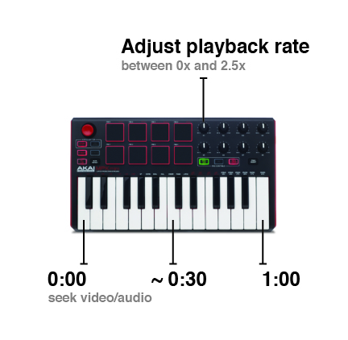

# YT Sampler
Your external midi keyboard controls any HTML audio/video element. Useful for scrubbing through long podcasts or for chopping and screwing (as crude music sampler).

This script will map piano keys to the duration of the first audio/video element on the page. So the key on the far left seeks to 0:00 and the key on the right seeks to the end of the audio/video. It also assigns the playback rate (speed) of the video to a knob.

This is a proof of concept. It's only been tested on an Akai MPK Mini although it should work with any midi device. There are some other features that I haven't documented yet. More info can be found [on this post](https://jameals.com/projects/yt-sampler/).

## Usage
The script should be copied and pasted into the dev tools console.

